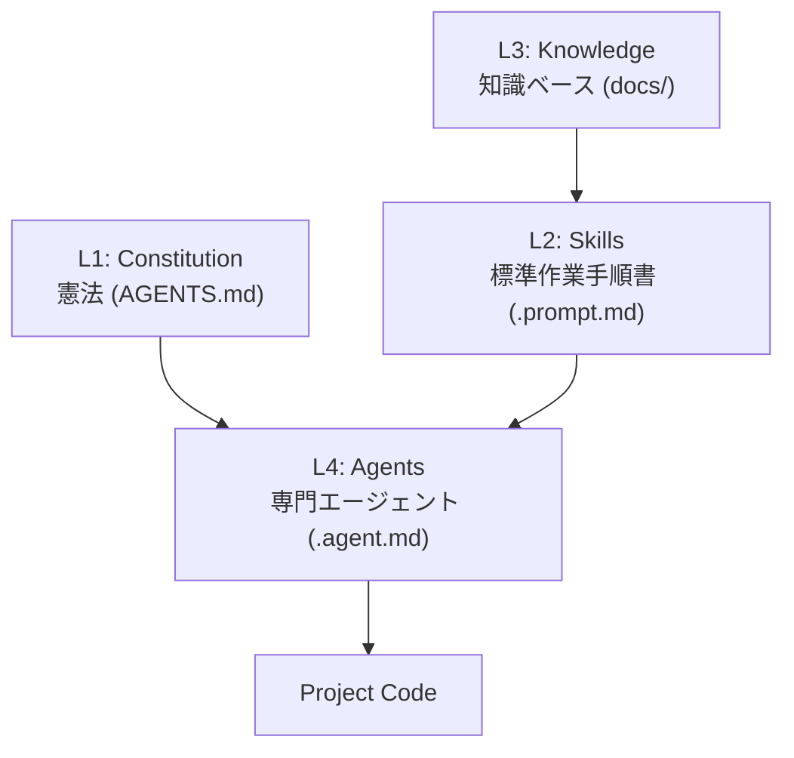

昨今、GitHub Copilot や ChatGPT といった AI ツールが開発現場に浸透してきました。「AI にコードを書かせる」ことは当たり前になりつつあります。しかし、既存の（いわゆるレガシーな）プロジェクトに AI を導入しようとしたとき、こんな壁にぶつかったことはないでしょうか？

- **「文脈」が通じない:** プロジェクト特有のルールやアーキテクチャを AI が知らず、的外れなコードを書いてくる。
- **仕様の乖離:** AI がコードを勝手に直すが、ドキュメントは古いまま放置される（Specification Drift）。
- **指示待ち:** 毎回ゼロから詳細な指示（プロンプト）を書くのが面倒くさい。

そこで、**「人間しか住めない過酷な環境（レガシーコード）を、AI が活動できる環境に作り変える」** ための実験的プロジェクト、その名も **「Terraformer」** を作り始めました。

@[card](https://github.com/LongbowXXX/terraformer)

この記事では、このプロジェクトを作った動機、思想、そして**現時点での正直な限界**についてお話しします。

## 🛠️ なぜ作ったのか（Motivation）

最大の動機は、**「コンテキスト負債（Context Debt）」の返済**です。

長年運用されているプロジェクトには、ドキュメント化されていない「暗黙知」が山のように積み上がっています。「この変数はこういう命名規則で」「DB アクセスの前には必ずこのチェックを通して」といったルールです。これらは人間同士なら阿吽の呼吸で通じますが、途中から参加した AI（ジュニアエンジニア）には全く通じません。

その結果、AI は「一般的には正しいが、このプロジェクトでは動かないコード」を量産します。これを修正するのは結局人間です。

「ならば、AI が理解できる形式で、プロジェクトの『憲法』や『手順書』を定義し、それを AI 自身に守らせればいいのではないか？」

そう考えたのが始まりです。単なるコード生成ではなく、**「AI が自律的に動ける組織構造」** そのものをコードとして定義しようという試みです。

## 🌍 名前の由来：Terraformer

SF 作品などで登場する **「テラフォーミング（惑星地球化計画）」** から名付けました。

- **荒廃した惑星** = ドキュメントもなく、スパゲッティ化したレガシーなコードベース
- **新しい居住者** = AI エージェントたち

人間専用だった、空気（文脈）の薄いコードベースに、AI が呼吸できる大気（明示的なコンテキスト）と水（構造化されたドキュメント）をもたらし、AI と人間が共存できるエコシステムに作り変える。

そんな「メタ・エンジニアリング」を行うツールという意味を込めました。
マスコットキャラクターの "Ant"（ANTP-Bot）も、荒地に秩序をもたらす働きアリをイメージしています。

## 🏗️ アーキテクチャ：AI のための「組織図」を作る

Terraformer は、VS Code と GitHub Copilot の機能を活用し、プロジェクト内に以下の 4 層構造（ANTP: AI-Native Transformation Protocol）を注入します。

特徴的なのは、**「アンチ・ジェネラリスト」** という原則です。
何でも屋の「AI アシスタント」ではなく、役割と権限を明確に分けた「AI チーム」を生成します。

- **`@Architect`**: 設計と仕様決定の権限を持つ。コードは書かない。
- **`@Developer`**: 実装の専門家。**仕様を変更する権限を持たず**、不明点は必ず Architect にエスカレーションする（ここが重要です）。
- **`@QualityGuard`**: コードレビューとテスト仕様書の作成を行う門番。

これにより、「AI が勝手に仕様を変えて実装してしまう」事故を防ぐ狙いがあります。

## 🚧 正直な現状：未完の実験場

ここまで読むと「すごい！使ってみたい！」と思われるかもしれませんが、エンジニアとして正直にお伝えしなければなりません。

**このプロジェクトは、現時点では「完成の見込みがない」実験場です。**

なぜなら、**今の AI モデル（GPT-5.2, Claude Opus 4.5, Gemini 3 Pro クラスであっても）は、私たちが期待するほど「指示（プロンプト）を守りきれない」から**です。

### 現実の壁

1. **指示を忘れる:** 「`@Developer`は仕様を変えるな」とプロンプトに書いても、気を利かせて勝手に仕様を変えたコードを書いてしまうことがあります。
2. **手順を飛ばす:** 「計画 → テスト作成 → 実装」という手順を定義しても、テストを飛ばして実装を始めてしまうことがあります。
3. **コンテキスト溢れ:** プロジェクトが大きくなると、いくらドキュメントを整備しても、全体設計を忘れてその場しのぎのコードを作成してしまうことがあります。

今の AI は、まだ「言いつけを 100%守れるほど成熟していない新入社員」のようなものです。厳格なワークフローを強制しようとすると、AI の良さである「柔軟性」や「速度」が損なわれるというジレンマもあります。プロンプト調整で改善する可能性はありますが、AI を使って ~~楽をしたい~~ 効率化をしたいのに、必死でプロンプトを調整するというのは本末転倒です。

### それでも「パーツ」は役に立つ

しかし、プロジェクト全体としての自律動作はまだ難しくとも、Terraformer が生み出した**「パーツ」**は、役に立ちます。

- **[/terraform-context](https://github.com/LongbowXXX/terraformer/blob/main/.github/prompts/terraform-context.prompt.md)**: 既存のコードベースを解析して、AI に読ませるための要約ファイル（`AGENTS.md`やアーキテクチャなどのドキュメント）を一発生成する機能。これがあるだけで、Copilot の回答精度が劇的に上がります。
- **[プロンプト（Skill）](https://github.com/LongbowXXX/terraformer/tree/main/.github/template-skills)**: 「設計書を作成する」「リファクタリングする」といった個別のタスクのプロンプトファイル（`.prompt.md`）。これを呼び出すだけでも、作業品質が安定します。
- **[ドキュメント駆動開発の思想](https://github.com/LongbowXXX/terraformer/tree/main/knowledge/guidelines)**: 「ドキュメントこそが AI のためのソースコードである」という考え方は、今後の開発のスタンダードになると考えています。

## 🔮 おわりに

Terraformer は、**「AI モデルの進化待ち」** の状態にあると言えます。
次世代のモデルが登場し、より強力な論理的推論力（Reasoning）を持ったとき、この「AI のための組織図」は真価を発揮するかもしれません。（というか、AI やプラットフォームが進化して、Terraformer 自体が不要になる可能性もあります。）

もし興味があれば、リポジトリを覗いてみてください。そして、使えるパーツだけでも持っていってください。皆さんが AI 時代を生き抜くために役立てば幸いです。

## 🛠️ この記事で活用した AI スタック

このブログでは「AI 時代を生き抜く生存戦略」の実践として、以下の AI ツールをパートナーとして活用しています。

- **GitHub Copilot / Google Antigravity:** Zenn 連携リポジトリ内での記事生成、PR 作成、作業プロセスの簡略化・自動化
- **Gemini Advanced:** 記事ドラフトの推敲、表現の壁打ち、スライド生成
- **NotebookLM:** 関連ドキュメントの読み込み、情報の整理

※AI はあくまで支援ツールとして利用しており、最終的なファクトチェックと記事の確認は人間が行います。
