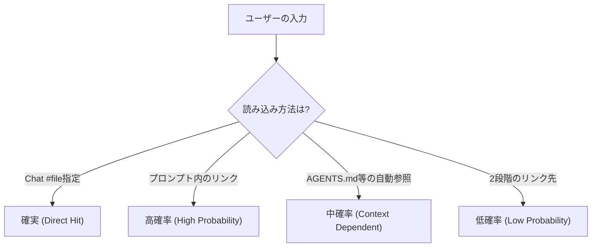

昔はメモリ破壊に悩まされたりしましたが、今は AI に与えるコンテキストで悩まされています。

優秀な AI パートナーですが、彼らと付き合う中で気づいたことがあります。

**「AI に何を読み込ませるか（コンテキスト）」の管理は、かつての「メモリ管理」と同じくらいシビアで、エンジニアの腕が試される領域だ**ということです。

今日は、私が実践している AI との協業における「コンテキスト提供」についてお話しします。

## AI の応答は「0 か 1 か」ではなく「確率」で変わる

まず、大前提として共有したい「感覚」があります。
プロンプトエンジニアリングやコンテキスト提供によって AI の挙動が変わるとき、それは「動く/動かない」のデジタルな変化ではなく、 **「望む回答が得られる確率が上がる/下がる」** というアナログな変化だということです。

かつてのプログラムは書いた通りにしか動きませんでしたが、LLM は違います。

- **適切なコンテキストを与える:** 正答率が上がる（確率アップ）
- **不要な情報を混ぜる（コンテキスト汚染）:** 混乱して幻覚を見る確率が上がる（確率ダウン）

この「確率のチューニング」こそが、我々の新しい仕事です。

## コンテキスト提供の「確実性階層」

私が日々 GitHub Copilot や各種 AI エージェントと対話する中で感じている、情報の読み込み強度（確実性）の階層を整理してみました。

### 1. Chat `#file` 指定：確実

「これを読め」と明示したファイルは、ほぼ確実にコンテキストに乗ります。もっとも信頼できる手段です。

### 2. カスタムプロンプト内のファイルリンク：高確率

カスタムプロンプト内で Markdown のファイルリンクを貼った場合も、かなり高い確率で読んでくれます。

### 3. `AGENTS.md`：中確率（要注意）

「AI への指示書」をリポジトリに置く手法です。
関連性が高いと判断されれば読まれますが、 **「読まないこともよくある」** のが落とし穴です。
私の経験上、「必ず読むように」と強い言葉で指示を入れると、読まれる確率は上がります。

### 4. 2 段階リンクとディレクトリ指定：低確率

「詳細はリンク先（A）を見て」→ A の中に「さらに詳細は B を見て」という **2 段リンク** は、読まれる確率がだいぶ下がります。  
また、ディレクトリ丸ごとの指定も、AI がツールを使ってディレクトリ内のファイルを把握してから中身を読む必要があるため、確率は下がります。  
重要なファイルは **AGENTS.md からファイル名指定でファイルリンク** してください。

## 「コンテキスト汚染」との戦い

「じゃあ全部読ませればいいじゃないか」と思うかもしれません。しかし、ここに **コンテキスト汚染** という罠があります。

タスクと関係のない仕様書や、不要なコードを読み込ませると、AI の回答精度は落ちていきます。
必要なのは、 **「最小限かつ十分な情報（Minimum Viable Context）」** を見極める選球眼です。

## コンテキストファイルの標準化：Terraformer の事例

では、どうすれば効率的にコンテキストを管理できるのか。
今後の課題であり、Terraformer プロジェクトでもチャレンジしています。

https://zenn.dev/longbow/articles/20260105_terraformer

- [Terraformer の AGENTS.md](https://github.com/LongbowXXX/terraformer/blob/main/AGENTS.md)
- [Terraformer のディレクトリ構成](https://github.com/LongbowXXX/terraformer/blob/main/docs/architecture/directory-structure.md)
- [Terraformer のナレッジ構成](https://github.com/LongbowXXX/terraformer/blob/main/knowledge/README.md)

コンテキストを提供するファイルを標準化することで、AI も人間も「どこを見ればいいか」が明確になります。

### 必須とすべきコンテキスト群

代表的なものとしては、以下のような情報を AI に提供するのが良いでしょう。

- プロジェクト概要
- アーキテクチャ
- 仕様、データ構造
- ディレクトリ構造
- コーディング/コメントルール
- テストガイドライン
- 各種出力テンプレート

これらを整理し、`AGENTS.md` 内にリンクを張り、 **『このファイルは Index なので、詳細はリンク先のファイルを読むこと』** と指示すると、関連するファイルを読む可能性が上がります。  
（トレードオフとして、余計なファイルを読む確率も若干上がります。）

- [Terraformer の Dynamic Context Protocol](https://github.com/LongbowXXX/terraformer/blob/main/knowledge/guidelines/prompting/dynamic-context.md)

## まとめ：AI を「使いこなす」ために

AI は魔法の杖ではありません。私たちが適切な情報を、適切なタイミングで、適切な量だけ与えて初めて、その真価を発揮する「道具」です。

- AI の挙動は確率で捉える。
- コンテキストの「読み込み強度」を意識する。
- 情報は標準化して整理しておく。

これらを意識することで、AI との開発はもっとスムーズに、そして楽しくなります。
かつてメモリマップとにらめっこしていたあの頃と同じように、今度はコンテキストとにらめっこしながら、ものづくりを楽しんでいきましょう。

## 🛠️ この記事で活用した AI スタック

このブログでは「AI 時代を生き抜く生存戦略」の実践として、以下の AI ツールをパートナーとして活用しています。

- **GitHub Copilot / Google Antigravity:** Zenn 連携リポジトリ内での記事生成、PR 作成、作業プロセスの簡略化・自動化
- **Gemini Advanced:** 記事ドラフトの推敲、表現の壁打ち、スライド生成
- **NotebookLM:** 関連ドキュメントの読み込み、情報の整理

※AI はあくまで支援ツールとして利用しており、最終的なファクトチェックと記事の確認は人間が行います。
