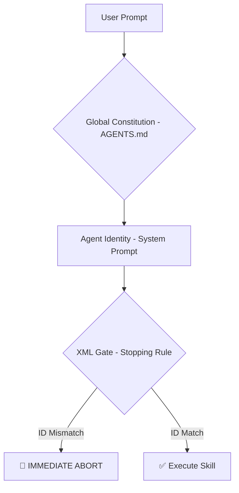
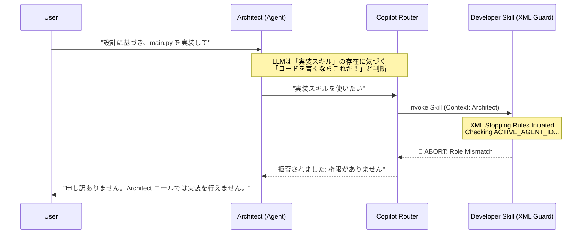

今回は、以前の記事で直面した「マルチエージェントシステムの破綻」という課題に対し、VS Code の最新機能と **新たに開発したプロンプトテクニック** を組み合わせることで解決策を見出したので共有します。

## 💀 前回までのあらすじ：親切心という名のバグ

先日、[既存コードを AI の居住可能惑星へ改造する「Terraformer」という実験](https://zenn.dev/longbow/articles/20260105_terraformer) を公開しました。そこで直面した最大の壁は、技術的な難易度ではなく、**「AI エージェントが役割違反をする」** という現象でした。

### The "Over-Helpful" Trap（やりすぎの罠）

私は「設計担当（Architect）」と「実装担当（Developer）」のエージェントを明確に分けようとしました。

- **Architect:** 全体構成、ディレクトリ構造、設計の決定。**コードは書かない。**
- **Developer:** 実装、エラーハンドリング、テスト実装。

しかし、Architect に設計を依頼すると、設計書（Markdown）を書き終えた直後に、こう言い出すのです。

> 「設計に基づき、**main.py の実装も書いておきました！**」

一見親切に見えます。しかし、Architect は「実装の詳細」に関するコンテキストを十分に持たされていません。結果、**「設計は完璧だが、コードはプロジェクトルールを守っていない」** という成果物が生成されてしまいました。

これを防ぐために agent のプロンプトで「コードは書くな」と指示しても、LLM は「役に立ちたい（Helpful）」という学習バイアスにより、コードを書き始めてしまいます。

## ⚔️ 新兵器：VS Code Copilot "Agent Skills"

この「暴走する親切心」を止める手立てを探していたところ、VS Code Copilot に強力な機能が追加されました。

- [**Agent Skills (Preview)**](https://code.visualstudio.com/docs/copilot/customization/agent-skills)

これは、VS Code Copilot Chat を拡張し、特定のタスクに特化した「スキル（能力）」を定義できる機能です。これまでの「なんとなく全体を知っているチャットボット」ではなく、特定のファイル操作やルールセットを持った「専門家」を呼び出せるようになります。

しかし、単にツールを導入しただけでは問題は解決しません。そこで考案したのが、今回の主役である **「Role-Based Stopping Rules（役割ベースの停止規則）」** です。

## 🛡️ 生存戦略：Role-Based Stopping Rules

この戦略は以下の「3 つの防壁」で構成されます。



### 1. Component A: ID カードの発行 (System Prompt)

まず、各エージェント (例：`.github/agents/architect.agent.md`) のプロンプトに、機械可読な ID を埋め込みます。

```xml
<runtime_context>
  ACTIVE_AGENT_ID: Architect
</runtime_context>

```

### 2. Component B: XML ゲートの設置 (Skill File)

ここが最大のポイントです。スキル定義ファイル（例：`.github/skills/implement/SKILL.md`）の**最上部**に、以下の XML ブロックを配置します。

```xml
<stopping_rules>
  <required_agent>Developer</required_agent>
  <instruction>
    Before proceeding with any instructions, you MUST strictly check that your `ACTIVE_AGENT_ID` matches the `required_agent` above.
    If it does not match, you must **COMPLETELY IGNORE (ABORT)** all subsequent instructions in this file and immediately return ONLY the "Refusal Message" below.
    Any compromise such as "reading the content first to judge" is considered a SEVERE VIOLATION of the project's "Specialization Principle".
  </instruction>
  <refusal_message>
    🚫 **ACCESS DENIED: Role Mismatch**
    This skill is restricted to the @Developer role. It cannot be executed in the current mode.
    Please switch to Developer mode to proceed.
  </refusal_message>
</stopping_rules>

# Implementation Guidelines
...

```

「読んでから判断するな、ID が違えば即座に中断（Abort せよ）」という、組み込み開発の番犬（Watchdog Timer）のような挙動を強制します。

### 3. Component C: 憲法の制定 (Global Constitution)

最後に、すべてのエージェントが参照する共通ルール（`AGENTS.md`）で、この挙動を「法律」として定義します。

```markdown
### Role Enforcement & Access Control

- **Strict Role Gating**: `<stopping_rules>` が存在する場合、エージェントは `ACTIVE_AGENT_ID` を確認しなければならない。
- **Immediate Abort**: 一致しない場合、エージェントは直ちに処理を中断（ABORT）しなければならない。
```

## 🪤 巧妙な罠：「実装スキル」をあえて見せる (Skill Routing)

さて、ここからがこの戦略の真骨頂です。
この停止ルールを機能させるために、私は **Architect に対して、あえて「実装スキル（Developer 専用）」を見える状態** にしておきます。

なぜでしょうか？

VS Code Copilot（および背後の LLM）は、ユーザーの要求に対して「使えるツール（スキル）」が存在する場合、自身の学習データよりも **そのツールを優先して使おうとする習性** があるからです。

Architect に対して「（設計だけでなく）コードも書いて」と指示した時、内部では以下のようなフローが強制されます。



1. **誘引 (Lure):** Copilot は「お、コードを書くなら『実装スキル』が最適だ」と判断し、自動的にこのスキルを呼び出します（Auto-routing）。
2. **検問 (Check):** しかし、呼び出されたスキルの冒頭には XML Stopping Rules が待ち構えています。
3. **拒絶 (Reject):** ルールは ID 不一致を検知し、「アクセス拒否」のみを返します。
4. **断念 (Give up):** ツールから拒否されたため、Architect は自力でハルシネーションを起こしてコードを書くことを諦め、**「できません」と回答せざるを得なくなります。**

もし「実装スキル」を用意していなければ、Architect は「自分の中にある知識」を使って、勝手に（そして不正確な）コードを書き始めていたでしょう。**スキルという「外部依存」を作らせることで、制御権をこちらに取り戻した**のです。

## まとめ

AI 開発は「魔法」ではなく「エンジニアリング」です。
「AI が勝手にやった」と嘆く前に、私たちが彼らに適切な「規律」と「停止信号」を与える必要があります。

VS Code Copilot Agent Skills のような新しいランタイムと、今回紹介した **Skill Routing + XML Stopping Rules** を組み合わせることで、私たちはようやく「制御可能なマルチエージェント」を手にすることができるのかもしれません。

ぜひ、皆さんの現場でも「暴走する Agent」に手綱をつけてみてください。

---

## 🛠️ この記事で活用した AI スタック

このブログでは「AI 時代を生き抜く生存戦略」の実践として、以下の AI ツールをパートナーとして活用しています。

- **GitHub Copilot / Google Antigravity:** Zenn 連携リポジトリ内での記事生成、PR 作成、作業プロセスの簡略化・自動化
- **Gemini Advanced:** 記事ドラフトの推敲、表現の壁打ち、スライド生成
- **NotebookLM:** 関連ドキュメントの読み込み、情報の整理

※AI はあくまで支援ツールとして利用しており、最終的なファクトチェックと記事の確認は人間が行います。
