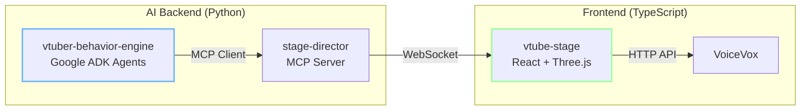

長年業界にいると、得意な領域だけで仕事が回るようになりがちです。しかし、AI 時代を生き抜くためには、未知の領域にも踏み込んで「生存戦略（スキルセット）」をアップデートし続けなければなりません。

今回は、私の個人的な **「技術的挑戦」** の記録です。

- **「Google ADK (Agent Development Kit) を触ってみたい」**
- **「今まで経験がなかった React や TypeScript を勉強したい」**

そんな動機から始まった、**完全自律型 AI V-Tuber システム** の開発記にお付き合いください。

## 📺 作っているもの：AI-Tuber System

絶賛開発中ですが、ある程度動くようになったので紹介します。  
Python (Backend) と TypeScript (Frontend) が連携して動くシステムです。

デモ動画をリポジトリのREADMEに載せているので、まずは[そちらを見てください](https://github.com/LongbowXXX/ai-tuber)。

「AI V-Tuber」というと LLM のレスポンス制御に目が行きがちですが、このシステムの裏テーマは **「バックエンド（Python/AI）とフロントエンド（React/TS）をどう分離して協調させるか」** でした。

### 📦 リポジトリ

https://github.com/LongbowXXX/ai-tuber

## 🛠️ なぜこのスタックを選んだのか

### 1. Google ADK (Agent Development Kit) への興味

「AI に何かをさせる」とき、単一のプロンプトでは限界があります。
Google が出している [ADK](https://google.github.io/adk-docs/) は、複数のエージェント（人格や役割）を協調させるフレームワークです。

複数のキャラクターを対話させるときに、個別のAgentに担当させて対話させるほうが深みが出るのでは？と考えました。

- 対話のための情報を提供するAgent
- キャラクター１のAgent
- キャラクター２のAgent

これらを切り替えて番組を成立させる制御を学ぶには、ADK がうってつけでした。

### 2. React / TypeScript への挑戦

正直に告白すると、私はこれまで Web アプリケーションのフロントエンド の経験がありませんでした。
しかし、AI エージェントの「身体」を作るには、リッチな Web 表現が不可欠です。

- 「型安全の恩恵を知るために TypeScript で書く」
- 「どうせやるなら人気の React を触る」
- 「3D 制御は Three.js (@pixiv/three-vrm) に挑戦する」

これらを **AI (Copilot や Gemini)** を「家庭教師」として活用しながら実装しました。ベテランであっても、AI の力を借りれば未知のスタックも恐れるに足らず。これが現代の生存戦略です。

### 3. 両者を繋ぐ MCP (Model Context Protocol)

慣れないフロントエンドと、AI バックエンドを疎結合にしたいと考えました。
そこで採用したのが **[MCP](https://modelcontextprotocol.io/)** です。

「話す」「動く」「表示する」という機能を MCP ツールとして定義し、AI はそれを呼ぶだけ。
これにより、**「React 側でどう実装されているか、Python 側の AI は知らなくていい」** という疎結合な構成を実現しました。（試行錯誤しながら作ったため、きれいに分離ができていないところが残っていますが…）

## 🏗️ 全体アーキテクチャ

React 初心者としての苦労点（useEffect の挙動や、Three.js のレンダリングループなど）は多々ありましたが、MCP でインターフェースを固定したおかげで、フロントエンドの試行錯誤がバックエンドに波及せずに済みました。

## 🚀 まとめ：未経験領域へのダイブ

今回の開発を通じて、**「AI 制御 (ADK)」** と **「現代的フロントエンド (React)」** という2つの経験をすることができました。

特に、「AI にコードを書かせながら学ぶ」というスタイルは、新しい技術を習得する上で非常に強力です。
もし「React はちょっと...」と食わず嫌いしているエンジニアの方がいれば、ぜひ AI を相棒に挑戦してみてください。意外となんとかなります。

ただし、AI に頼りすぎると、いつまでたっても手につかないので注意してください。

## 🙏 利用素材・クレジット

本プロジェクトでは、以下の素晴らしい 3D モデルを利用させていただきました。

- **ずんだもん**: [VRoid Hub](https://hub.vroid.com/characters/821734897565535106/models/8611519130687999893)
- **四国めたん**: [VRoid Hub](https://hub.vroid.com/characters/6844984887981314416/models/4463092040338219016)

**東北ずん子 ずんだもん プロジェクト キャラクター利用の手引き**
https://zunko.jp/guideline.html

本記事のデモ動画や画像、および公開しているリポジトリ内のサンプルコードで使用しているキャラクターは、上記ガイドラインおよびライセンスに基づいて利用しています。

---

## 🛠️ この記事で活用した AI スタック

このブログでは「AI 時代を生き抜く生存戦略」の実践として、以下の AI ツールをパートナーとして活用しています。

- **GitHub Copilot / Google Antigravity:** React/TypeScript のコード生成、ADK の実装支援
- **Gemini Advanced:** 設計の壁打ち、記事ドラフトの推敲
- **NotebookLM:** 学習リソースの読み込みと整理

※AI はあくまで支援ツールとして利用しており、最終的なファクトチェックと記事の確認は人間が行います。
