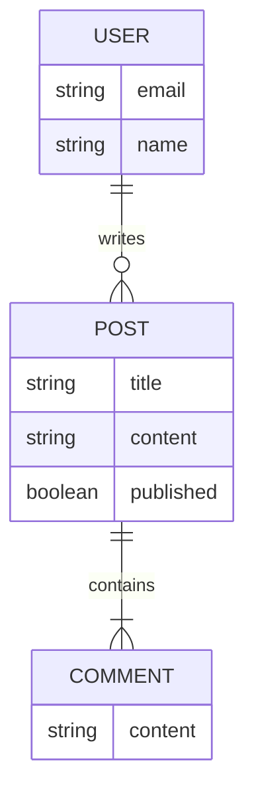

## はじめに：AIは「察して」くれない

長年この業界にいると、ドキュメントというのは「嘘をつくもの」だという諦めが板についてきます。仕様書は実装された瞬間に陳腐化し、READMEは更新されず、真実はソースコードと古参エンジニアの頭の中にしかない——それが我々が生き抜いてきた現場のリアルでした。

しかし、AIコーディングアシスタント（GitHub Copilot, Cursor, Claude Codeなど）をパートナーとして使いこなそうとしたとき、この「人間頼み」の文化が最大のボトルネックになります。

「AIが嘘をつく」「古いライブラリを使いたがる」「プロジェクトの規約を無視する」。

これらの不満の多くは、AIの能力不足ではなく、我々がAIに渡している**コンテキスト（文脈）の質と量**に問題があります。

新しく入った優秀なエンジニアに、何も資料を渡さず「あとはコード読んでよしなにやって」と丸投げしたらどうなるか？ AIに対しても、我々は同じことをしていないでしょうか。

:::message
あなたは AI にとって優秀なパートナーになれていますか？
:::

この記事では、プロジェクトを「AI Ready」な状態——つまり、AIが自律的かつ正確にタスクを遂行できる状態——にするための第一歩について紹介します。  
AIへの指示書として多くのアシスタントで利用できる `AGENTS.md` と、Mermaid記法を活用した「視覚的コンテキスト」の設計に焦点を当てます。

## 第1章：「AI Ready」なコードベースとは

かつてドキュメントは「人間が読むもの」でしたが、これからは「AIエージェントに読ませるもの」という視点が必要です。AI Readyなプロジェクトには、以下の3つの要素が不可欠です。

1. **機械可読性 (Machine Readability):** 曖昧な自然言語ではなく、構造化された明確な指示があること。
2. **検証可能性 (Verification):** AIが書いたコードの正しさを、人間が目視する前にコマンド一発で判定できること。
3. **コンテキストの階層化:** 必要な情報だけを適切なタイミングでAIに渡す仕組みがあること。

特に重要なのが3点目です。LLMのコンテキストウィンドウは広がっていますが、無関係な情報を詰め込むと「コンテキスト汚染（Context Pollution）」が発生し、推論精度が低下します。

そこで登場するのが、`AGENTS.md` です。

## 第2章：AI のためのREADME AGENTS.md

`AGENTS.md` は、AIエージェントのために書かれた専用のREADMEです。人間向けの `README.md` が「プロジェクトの概要」を説明するのに対し、`AGENTS.md` は「作業の手順とルール」を命令形で記述します。

### 2.1 どこに置くのか？

**リポジトリのルート直下（一番上の階層）** に配置します。これが基本です。

エージェントはプロジェクトを読み込む際、まずこのファイルを探しに行きます。ここにプロジェクト全体のルールを記述しておくことで、どのファイルを編集している時でも、エージェントが迷わずに正しい振る舞いを選択できるようになります。

### 2.2 AGENTS.md のテンプレート（XMLタグ活用版）

AIエージェントへの指示において、**XMLタグ（`<tag>...</tag>`）を使うことは、プロンプトエンジニアリングにおける強力なテクニック**です。以下のテンプレートを使って解説します。

```markdown:AGENTS.md
<project_info>
このプロジェクトは [プロジェクトの概要] です。
主な技術スタック: Next.js (App Router), TypeScript, Tailwind CSS, Supabase
</project_info>

<codebase_structure>
- src/app: アプリケーションのページとレイアウト
- src/components/ui: 汎用UIコンポーネント（Shadcn UIベース）
- src/lib: ユーティリティ関数と型定義
- supabase: データベースのマイグレーションファイル
</codebase_structure>

<validation_rules>
コードを変更した際は、以下の手順で検証を行うこと。
1. **Lint**: npm run lint を実行し、エラーがないことを確認する。
2. **Type Check**: npm run type-check を実行する。
3. **Test**: 関連するコンポーネントのテストを npm run test -- <filename> で実行する。

**絶対ルール**: これらがPassしないコードはコミットしてはいけません。
</validation_rules>

<coding_conventions>
- **コンポーネント**: 関数コンポーネントを使用し、export const で定義する。
- **スタイリング**: Tailwind CSSのユーティリティクラスを優先する。複雑なスタイルは cva を使用する。
- **データフェッチ**: Server Componentsでのフェッチを基本とする。クライアントサイドでのフェッチが必要な場合は SWR を使用する。
</coding_conventions>

```

### 2.3 なぜ XMLタグを使うのか？

「マークダウンの見出し（`##`）でいいじゃないか」と思われるかもしれません。しかし、LLM（大規模言語モデル）の特性を考えると、XMLタグには明確なメリットがあります。

1. **認識精度の向上:** LLMはHTMLやXMLを含む膨大なコードデータで学習しています。そのため、`<validation_rules>` のようなタグを見ると、「ここからここまでが検証ルールである」という**開始と終了の境界**を極めて正確に認識します。
2. **コンテキストの分離:** マークダウンの見出しだと、話が長くなった際にどこまでがそのセクションなのかAIが見失うことがあります。XMLタグで囲む（wrapする）ことで、情報が他のセクションに「漏れ出す」のを防ぐことができます。

これは **「構造化プロンプト（Structured Prompting）」** と呼ばれる手法で、Anthropic社のClaudeなどが特に推奨しているベストプラクティスの一つです。

## 第3章：Mermaid で視覚的コンテキストを強化する

テキストだけでは伝わりにくいアーキテクチャやデータフローは、図にするのが一番です。

Mermaidの素晴らしい点は、**「テキストベース」であるため、LLMが構造を完全に理解し編集できる**点です。

### 3.1 AIによる「リバースエンジニアリング」作図

ドキュメントがないレガシーコードをAI Readyにする方法の一つに、AI自身にコードを読ませて、Mermaidの図を描かせるというものがあります。

**プロンプト例:**

> src/models ディレクトリ内のPrismaスキーマを解析し、テーブル間の関係を表すMermaidのER図（erDiagram）を生成してください。

これによって生成されたコードを `docs/schema.mermaid` として保存し、`AGENTS.md` からリンクします。これだけで、エージェントはデータベースの構造を「視覚的」かつ「構造的」に把握できるようになります。

**例（ER図）:**



### 3.2 推奨される図の種類

AIへのコンテキスト提供において、特に効果が高いのは以下の4つです。

1. **クラス図:** クラスの継承関係や依存関係の理解用。
2. **シーケンス図:** 非同期処理やAPI連携のフロー理解用。
3. **フローチャート:** 複雑な条件分岐のロジック理解用。
4. **ER図:** データモデルの理解用。

## 第4章：信頼するための「バリデーション」

AI Ready化の仕上げは、検証プロセスの確立です。

1. **`AGENTS.md` による明確な指示**
2. **AIによるコード生成**
3. **自動テストとリンターによる検証**

AIが出力したコードを目視だけでチェックするのは、シニアエンジニアの時間の無駄です。`AGENTS.md` に具体的なテストコマンド（例：`npm test`）を記載することで、エージェント自身に「コードを書く→テストを実行する→エラーを直す」という**自己修復ループ**を回させることができます。

AI によって、テストを作成するコストは激減しています。テストを作成するほうが、AIが書いたコードにバグがないか必死にレビューするよりも、はるかに生産的な時間の使い方です。

## まとめ：ドキュメントは未来への手紙

「AI Ready」なプロジェクトにすることは、AIのためだけではありません。明文化されたルール、整備された図、自動化されたテストは、結局のところ**人間のエンジニアにとっても快適な開発環境**そのものです。

まずはルートディレクトリに空の `AGENTS.md` を作り、そこに「いつも口頭で注意していること」を3行書くところから始めてみてください。それは、あなたのプロジェクトが次世代へと進化するための第一歩となるはずです。

そして、情報量が増えてきたら、各種ガイドラインとして別ファイルに切り出して、`AGENTS.md` から参照するようにしましょう。  
参照リンクには、AI がそのドキュメントを読むか判断しやすいように簡単な説明文を添えましょう。

:::message
毎回絶対AIに読ませたい重要事項は、AGENTS.mdに記載しましょう。
:::

## 私が過去に書いた関連記事

@[card](https://zenn.dev/longbow/articles/20260108_context_managing)

@[card](https://zenn.dev/longbow/articles/20260114_github_copilot_log_analysis)

@[card](https://zenn.dev/longbow/articles/20260105_terraformer)

## 🛠️ この記事で活用した AI スタック

このブログでは「AI 時代を生き抜く生存戦略」の実践として、以下の AI ツールをパートナーとして活用しています。

- **GitHub Copilot / Google Antigravity:** Zenn 連携リポジトリ内での記事生成、PR 作成、作業プロセスの簡略化・自動化
- **Gemini Advanced:** 記事ドラフトの推敲、表現の壁打ち、スライド生成
- **NotebookLM:** 関連ドキュメントの読み込み、情報の整理

※AI はあくまで支援ツールとして利用しており、最終的なファクトチェックと記事の確認は人間が行います。
