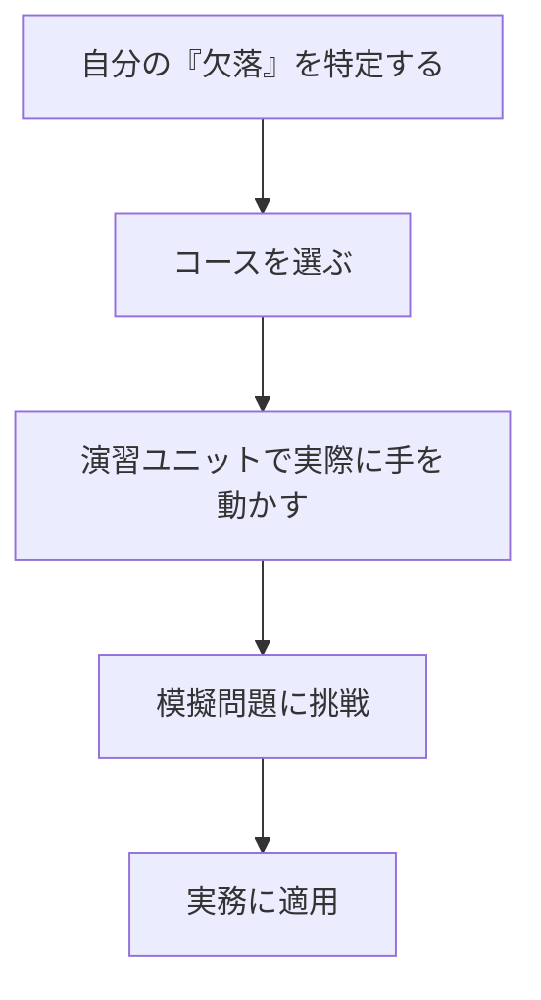

## 結論：迷ったら「Microsoft Learn」をのぞいてみよう

自分に技術が足りていないことを理解しながらも、何から始めたらよいかわからずに歩みを止めてしまっている技術者の皆様へ。

結論から言います。  
情報の海で溺れて何から手を付ければわからなくなっているのであれば、まずは Microsoft Learn を覗いてみてください。

https://learn.microsoft.com/ja-jp/

「え、マイクロソフト製品（WindowsやAzure）専用じゃないの？」と思ったあなた、その認識は少し古いかもしれません。Microsoft Learn は、GitHub や AI 開発など、様々なスキルを学べる、**質の高い無料学習プラットフォーム**となっています。

## なぜ Microsoft Learn が「生存」に役立つのか

### 1. 大企業という信頼性と「無料」という参入障壁の低さ

世の中には高額なスクールや、出所の怪しい情報商材が溢れています。しかし、[Microsoft Learn の利用料は無料](https://learn.microsoft.com/ja-jp/training/support/faq?pivots=general#how-much-does-the-training-cost)です。
「企業の教育への活用」も[公式に推奨](https://learn.microsoft.com/ja-jp/training/support/integrations)されており、学習管理システムとの連携まで考慮されています。

### 2. 「GitHub」と「AI」という現代の武器が揃っている

今は AI をどう使いこなすかが生存に直結します。Microsoft Learn では以下のフィルタリングが非常に有効です。

- **GitHub でフィルタ:** Git の基礎から、[GitHub Copilot](https://learn.microsoft.com/ja-jp/training/browse/?products=github) の活用法まで学べます。
- **AI エンジニアでフィルタ:** 今最も熱い [AI エンジニア](https://learn.microsoft.com/ja-jp/training/browse/?roles=ai-engineer) 向けのパスが用意されています。

## 効率的な学習の進め方

ただ漫然とコースを眺めるのは時間がもったいないので、以下のフローを推奨します。

1. **「GitHub」Productを選択する:** 今のトレンドは、単にコードを書くことではなく、AI
   アシスタント(GitHub Copilot)を活用してコードを書くことです。[このフィルタ](https://learn.microsoft.com/ja-jp/training/browse/?products=github)から始めるのが最短ルートです。
2. **モジュール単位でつまみ食いする:** 最初から最後まで律儀にやる必要はありません。自分に足りないピースだけを拾い上げてください。
3. **公式ドキュメントへのハブとして使う:** 解説の途中に埋め込まれているリンクから、より深い仕様書へ飛ぶ癖をつけましょう。

## まとめ：学ぶことで自分の中に「軸」を育てる

SES として働いていると、現場ごとに異なる「独自ルール」に苦しめられることがあると思います。しかし、公式が提示するベストプラクティスを一度身につけておけば、それが強力な「軸」になります。

情報が溢れすぎて、何から手を付けたらよいかわからなくて困っているなら、まずは Microsoft Learn から始めてみてはいかがでしょうか。

:::message
学ばずに技術力が上がることはありません。技術者という「職業」を維持するためには、常に学び続けることが必須となります。
:::

※なお、念のため。これは PR 記事ではありません。一人のエンジニアとして、有益なツールをシェアしたいという、ただの「おせっかい」です。

共に、この刺激的な時代を生き残りましょう。

---

## 🛠️ この記事で活用した AI スタック

このブログでは「AI 時代を生き抜く生存戦略」の実践として、以下の AI ツールをパートナーとして活用しています。

- **GitHub Copilot / Google Antigravity:** Zenn 連携リポジトリ内での記事生成、PR 作成、作業プロセスの簡略化・自動化
- **Gemini Advanced:** 記事ドラフトの推敲、表現の壁打ち、スライド生成
- **NotebookLM:** 関連ドキュメントの読み込み、情報の整理

※AI はあくまで支援ツールとして利用しており、最終的なファクトチェックと記事の確認は人間が行います。
