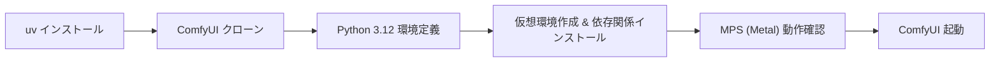

今回は、しばらく前に生成AIの実験用に購入した **Mac Mini M4 Pro (メモリ64GB)** を活用し、ノードベースで画像や音声などの生成を行える [ComfyUI](https://github.com/Comfy-Org/ComfyUI) の環境を構築した記録を共有します。

単にインストールするだけなら、インストール用バイナリなどが配布されていますが、エンジニアなのでマニュアルインストールに挑戦しました。  
後々のメンテナンスやライブラリの衝突（Dependency Hell）に悩まされないよう、Rust製の超高速Pythonパッケージマネージャ [uv](https://github.com/astral-sh/uv) を採用して、環境を構築します。

## 🏗️ 全体フロー

まずは構築の流れを整理します。



## 1. 武器の手入れ：uv のインストール

Pythonの環境管理には、`uv` を採用します。Rust製で速い。速いのは良いことです。

公式の [インストールスクリプト](https://github.com/astral-sh/uv) を使用します。

```sh
curl -LsSf https://astral.sh/uv/install.sh | sh
```

インストール後、シェルを再起動してバージョンを確認します。

```sh
uv --version
```

## 2. ComfyUI の準備とPythonバージョンの固定

### リポジトリのクローン

公式リポジトリを適当な作業ディレクトリにクローンします。  
クローン方法は割愛します。

https://github.com/Comfy-Org/ComfyUI

### Python バージョンの選定

ComfyUI公式の [README](https://github.com/Comfy-Org/ComfyUI) には、Pythonのバージョンについて以下の言及があります（執筆時点）。

> Python 3.14 works but some custom nodes may have issues...  
> **Python 3.13 is very well supported.** If you have trouble with some custom node dependencies on 3.13 you can try 3.12

カスタムノード（拡張機能）の互換性を考慮し、ここでは **安定の Python 3.12** を採用します。枯れた技術（ここでは安定版）を選ぶのが、無用なトラブルを避けるコツです。

### プロジェクト設定（pyproject.toml）

`uv` に「このプロジェクトではPython 3.12を使いたい」と明示するため、`pyproject.toml` を編集します。これにより、ComfyUIプロジェクトの環境を固定できます。

```toml:pyproject.toml
[project]
requires-python = "==3.12.*"
```

## 3. 仮想環境の構築と依存関係のインストール

設定ファイルができたら、仮想環境を一発で作ります。

```sh
uv venv
```

これで `.venv` ディレクトリが作成され、そこには Python 3.12 がセットされます。
続けて、ComfyUIに必要なライブラリを一気にインストールします。

```sh
uv pip install -r requirements.txt
```

## 4. Mac特有の儀式：MPS (Metal) の確認

Mac (Apple Silicon) で PyTorch を動かす場合、Appleの **MPS (Metal Performance Shaders)** を利用します。これが有効になっていないと、せっかくのM4 Proもただの箱です。CPUで画像生成なんて、日が暮れてしまいますからね。

念のため、以下の確認用スクリプト `torch_mps.py` を作成します。 [公式手順](https://developer.apple.com/metal/pytorch/) を参考にしています。

```python:torch_mps.py
import torch
if torch.backends.mps.is_available():
    mps_device = torch.device("mps")
    x = torch.ones(1, device=mps_device)
    print(x)
else:
    print("MPS device not found.")
```

`uv run` コマンドで、先ほど作った仮想環境上でスクリプトを実行します。

```sh
uv run python torch_mps.py
```

出力結果が `tensor([1.], device='mps:0')` となればOKです。M4 ProのGPUコアが活用できます。

## 5. ComfyUI の起動

いよいよ起動です。今回はメモリ64GBという潤沢な環境なので、`--highvram` オプションをつけて、VRAMを積極的に使いに行く設定にします。また、ローカルネットワーク内の他のPC（iPadやWindows機など）からも操作できるように `--listen` をつけます。

```sh
uv run python main.py --highvram --listen
```

ブラウザで `http://0.0.0.0:8188/` または `http://localhost:8188/` にアクセスし、UIが表示されれば成功です。

LAN内の別の端末からアクセスしたい場合は、MacのIPアドレスを確認し、`http://[MacのIPアドレス]:8188/` で接続できます。ソファでiPadから生成を指示するのも乙なものです。

## 6. 最初の一歩：使い方のヒント

起動直後は空っぽのキャンバスかもしれません。左側のメニューからテンプレートを選択し、まずはテンプレートのワークフローを試してみましょう。


### モデルのダウンロードについて

テンプレートを選んで実行しようとすると、モデルファイルが足りないことがあります。ComfyUIは賢いので、不足ファイルを教えてくれます。

1. 不足時のダイアログで「ダウンロード」をクリック。
   
2. ブラウザのセキュリティで、ダウンロードが阻害された場合は、許可する。
3. ダウンロードしたファイルは `models/checkpoints` など、指定されたディレクトリに配置する。

まずは、**「画像」** カテゴリにある **SDXL** 系のテンプレートや、**「オーディオ」** の **ACE-Step 1.5** などを試してみるのがおすすめです。
（API を使うものは、設定が必要なので、まずはAPIが不要なものから試しましょう）

## まとめ

これで、Mac Mini M4 Pro 上に、`uv` で管理された ComfyUI 環境が整いました。
64GBのユニファイドメモリがあれば、ある程度重量級モデルでもローカルで動かせるポテンシャルがあります。

AIは魔法ではなく、単なる「道具」です。しかし、手入れされた道具は使い手の能力を何倍にも拡張してくれます。よき生成ライフを！

---

## 🛠️ この記事で活用した AI スタック

このブログでは「AI 時代を生き抜く生存戦略」の実践として、以下の AI ツールをパートナーとして活用しています。

- **GitHub Copilot / Google Antigravity:** Zenn 連携リポジトリ内での記事生成、PR 作成、作業プロセスの簡略化・自動化
- **Gemini Advanced:** 記事ドラフトの推敲、表現の壁打ち、スライド生成
- **NotebookLM:** 関連ドキュメントの読み込み、情報の整理

※AI はあくまで支援ツールとして利用しており、最終的なファクトチェックと記事の確認は人間が行います。
