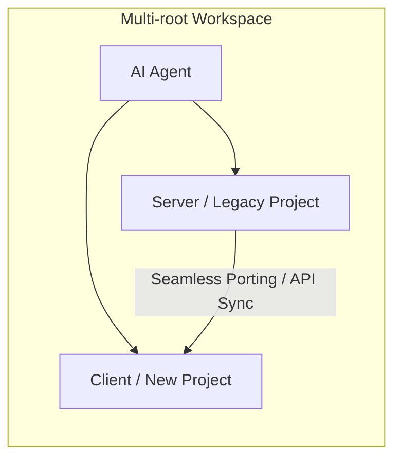

## 結論：AI に「新旧コード」や「サーバー・クライアント」を同時に見せれば、開発効率は 3 倍になる

サーバーとクライアントのプロジェクトを別ウィンドウで開いていませんか？ あるいは、コードを移植するために複数のエディタを往復していませんか？

VS Code の [Multi-root Workspaces](https://code.visualstudio.com/docs/editing/workspaces/multi-root-workspaces) を使えば、異なるリポジトリ・プロジェクトを一箇所に集約できます。これにより、GitHub Copilot などの AI ツールが **「プロジェクトの垣根を越えた軍師」** へと進化します。

## 応用：プロジェクト間の「機能移植」こそが真骨頂

このテクニックの真価は、単なる同時開発だけではありません。**「別プロジェクトからの機能移植」** において圧倒的な威力を発揮します。

かつての私たちは、移植といえば「コードをコピーし、足りない依存関係を手動で解決し、型エラーと格闘する」という苦行でした。しかし、マルチワークスペースなら AI にこう指示するだけです。

> 「Project A の `Auth` 機能を、Project B のディレクトリ構成に合わせて移植して。その際、Project B で使っているライブラリに合わせて書き換えて」

AI は両方のプロジェクトの構成、ライブラリ、規約を同時に把握しているため、ディレクトリ構造の違いや依存関係の差異を考慮した「動くコード」を生成してくれます。

## なぜ「ウィンドウの壁」を壊すべきなのか

1. **AI への「文脈の供給」**: AI は開いているファイルやフォルダをコンテキストとして参照します。ウィンドウが分かれていると、AI は「隣のプロジェクト」の存在に気づけません。
2. **認知負荷の低減**: サーバー側の API を修正し、即座にクライアント側の呼び出しを直す。Windowを移動せずに編集を継続できることで、エンジニアの「ゾーン」を維持します。
3. **整合性の担保**: マルチワークスペースなら、プロジェクトを跨いだ一括置換やリファクタリングも容易です。

## 実装ガイド：3 ステップで「マルチワークスペース」を作る

1. **フォルダの追加**: VS Code で片方のプロジェクトを開いた状態で、 `File` > `Add Folder to Workspace...` からもう一方を追加。
2. **ワークスペースの保存**: `File` > `Save Workspace As...` で `.code-workspace` ファイルを作成。
3. **AI への命令**: Chat 欄で「フォルダ A の 〇〇 を フォルダ B に合うように移植して」と投げかける。

## 概念図：AI の視界

## まとめ：道具の「境界」を消し、思考を加速させる

技術の基礎は不可欠ですが、それを支える「道具」の使いこなしで生存率は大きく変わります。「リポジトリが別だから」という制約は、人間が決めた都合に過ぎません。

マルチワークスペースによってエディタの境界を消し去り、AI にプロジェクト全体を俯瞰させる。これこそが、複雑化する現代の開発で生き残るための、スマートな生存戦略です。

## 🛠️ この記事で活用した AI スタック

このブログでは「AI 時代を生き抜く生存戦略」の実践として、以下の AI ツールをパートナーとして活用しています。

- **GitHub Copilot / Google Antigravity:** Zenn 連携リポジトリ内での記事生成、PR 作成、作業プロセスの簡略化・自動化
- **Gemini Advanced:** 記事ドラフトの推敲、表現の壁打ち、スライド生成
- **NotebookLM:** 関連ドキュメントの読み込み、情報の整理

※AI はあくまで支援ツールとして利用しており、最終的なファクトチェックと記事の確認は人間が行います。
