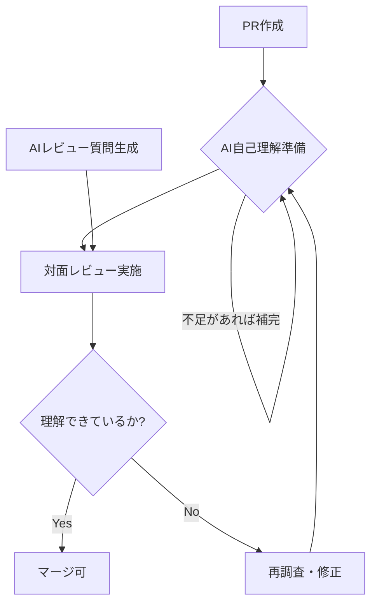

エンジニアが AI を使ってコーディングするのが当たり前の時代になりました。
私のような 20 年選手から見ても、これほど強力な「生存のための武器」はありません。

しかし、エンジニア界隈で「危うい兆候」が増えているように感じます。それは、**「AI が書いたので、細かい挙動は理解していない」という説明責任の放棄** です。
特に若手層において、Pull Request (PR) の修正内容を本人が理解しきれていないにかかわらず、AIが十分な品質のコードを生成しているため、レビューをパスしてマージされてしまうリスクは無視できません。

結論から述べます。**これからの（若手の）レビューは「本人の理解度」をチェックする対面スタイルを取り入れるべきです。**

そのための武器として、「理解確認プロンプト（SKILL）」を作成しました。

---

## ⚠️ AI 時代に陥りがちな「理解の空白」

AI コーディングアシスタント（[GitHub Copilot](https://github.com/features/copilot) など）は、開発スピードを劇的に向上させます。

しかし、スピードの代償として「なぜその API を選んだのか」「なぜその制御フローにしたのか」という思考プロセスが抜け落ちがちです。テキストベースのレビューでは、その返信すら AI に書かせてしまうことができるため、本人の血肉になっているかを確認するのが難しくなっています。

そこで、**「AI を使って、対面レビューの質を上げる」** という逆転の発想が必要になります。


---

## 🔄 導入すべき「理解確認レビュー」のフロー

対面レビューを効率化するために、以下のフローを推奨します。シニア側のリソースを最小限にしつつ、若手の理解を最大化することを目的とします。



---

## 🛠️ 二つの「生存武器」：理解確認用 SKILL

今回、対面レビューを円滑にするための二つのプロンプト定義（SKILL）を作成しました。

### 1. 【若手向け】PR自己理解準備 SKILL

PR を出す本人が、レビュー前に「自分はどこまで理解できているか」をセルフチェックするためのものです。

- **役割:** 変更理由、API の意味、依存関係を自分の言葉で言語化させる。
- **メリット:** 「説明に詰まる箇所」を事前に特定できるため、レビューの時間が短縮されます。

```markdown
---
name: pr-self-understanding-prep
description: "PR作成者本人が対面レビュー前に、自分の変更内容の理解を深め、説明に詰まる点や理解不足を洗い出すための自己確認を行う。レビューに備えるための確認質問、期待できる説明、追加で確認すべき点を整理するときに使う。"
---

# PR自己理解準備

## 目的

PR作成者本人が、対面レビューで質問を受ける前に、自分の修正内容をきちんと理解できているかを自己確認する。

このスキルは、PR内容をその場で直すことではなく、次を明確にすることに重点を置く。

- 変更理由を自分の言葉で説明できるか
- 利用しているAPIやライブラリ機能の意味を説明できるか
- 変更が依存している仕組みや制御フローを説明できるか
- レビュー指摘への修正内容を説明できるか
- 自分がまだ曖昧な点、説明に詰まりそうな点がどこか

## 使う場面

- 対面レビューの前に、自分のPR理解を整理したいとき
- AIを活用して実装したコードについて、自分で説明できる状態にしたいとき
- すでにレビュー指摘を受けて修正した内容まで含めて、説明準備をしたいとき
- 質問される前に、自分の理解不足を先に洗い出したいとき

## 使わない場面

- PRの実装内容をすぐに変更したいとき
- コード修正やリファクタリングを自動で進めたいとき
- 人物評価や自己評価コメントを書きたいとき

## 入力

最低限、以下の情報を使う。

- PRのタイトル
- PRの概要または本文
- 主な変更ファイルまたは変更領域
- 追加・変更した主要なAPI、ライブラリ、フレームワーク機能
- すでに受けたレビュー指摘と、その対応内容
- 初回レビュー以降に追加・修正した差分の要約
- テスト内容、または未実施理由

不足している場合は、自己確認を始める前に不足を明示し、先に補う。

## 進め方

1. まずPR情報の充足度を確認する。

次が不明なら、先に補足を求める。

- 何を解決するPRか
- どの振る舞いが変わるのか
- どのファイルまたはレイヤーが主戦場か
- なぜそのAPIや実装方式を選んだのか
- どうやって動作確認したのか
- すでに受けた指摘のうち、何をどう直したのか
- 指摘対応で新たに変えた箇所がどこに波及したのか

2. PRの性質を分類する。

次のどちらに近いかを判断する。

- 小さいPR: 文言修正、単純な条件追加、軽微な配線、既存パターンの踏襲
- 大きいPR: 状態管理、ライフサイクル、非同期処理、イベント連携、描画更新、データフロー、例外処理、設計境界などの仕組み変更を含む

加えて、次のどちらかも確認する。

- 初回レビュー前のPRか
- すでにレビュー済みで、指摘対応の修正が入っているPRか

3. 自己確認の重心を決める。

- 小さいPRでは、変更理由と利用APIの理解を中心に3から5項目に絞る
- 大きいPRでは、仕組みの変更点、制御フロー、失敗時挙動、代替案、テスト戦略を中心に5から8項目出す
- 指摘対応後のPRでは、元の指摘内容、修正方針、修正の波及範囲、再テスト内容を説明できるかを必ず含める
- 差分が広くても、単に変更量で判断せず、挙動や仕組みが変わる箇所を優先する

4. 各項目について、自分で説明できるかを確認する。

各項目は次の形で出す。

### 出力項目

- 自己確認の質問
- この質問で確認したい理解
- 説明できるべき内容
- 詰まりやすい兆候
- 追加で確認すべきコードや観点

5. 質問カテゴリを最低3つ含める。

必要に応じて次から選ぶ。

- 変更理由の理解
- 利用APIやライブラリ機能の理解
- 仕組み、制御フロー、データフローの理解
- レビュー指摘への修正内容の理解
- 境界条件、失敗時挙動、例外処理の理解
- テスト方法と未検証領域の理解
- 代替案と採用しなかった理由の理解

6. 表面的な言い換えで済まない自己確認を混ぜる。

例えば次を使う。

- この引数がこの値である必要はどこから来るか
- このAPIを別のAPIに置き換えると何が壊れるか
- この処理は再実行されたとき何が起きるか
- このロジックを1段前または1段後ろに移すと何が変わるか
- この変更を元に戻すと、どの不具合や制約が再発するか

レビュー指摘への対応が含まれる場合は、例えば次を使う。

- その指摘は何を問題にしていて、今回の修正はどう解決しているか
- 指摘された箇所だけでなく、周辺のどこまで見直す必要があったか
- その修正が妥当だとどこで判断したか
- 修正によって新しく壊れうる箇所をどう洗い出したか
- 初回の実装と今回の修正で、設計上の理解がどう変わったか

7. 理解不足を明確に切り分ける。

次のどれに当たるかを区別する。

- コードを読めば説明できる
- 仕組みは分かるが、選定理由が曖昧
- テスト観点が曖昧
- 指摘対応の意図が曖昧
- まだ自分では説明できない

8. 修正は勝手に行わない。

- このスキルの役割は理解確認までに限定する
- PR内容の修正、コード変更、文章修正は、利用者から明確な指示があった場合だけ行う
- 修正案を出す場合でも、まず理解不足として分離して示す

9. PR情報が不足している場合は、その不足を先に出力する。

この場合の出力順は次の通り。

- 先に「追加で必要なPR情報」
- 次に「現時点でできる自己確認」
- 最後に「情報が揃ったら追加で確認すべき観点」

## 出力形式

以下の形式で出す。

### 1. 準備方針

- このPRで自分が重点的に理解すべき観点
- このPRが小さいPRか大きいPRかの判断
- 初回レビュー前か、指摘対応後かの判断
- 情報不足があればその一覧

### 2. 自己確認項目

各項目について、次を必ず含める。

#### 項目N

- 自己確認の質問
- この質問で確認したい理解
- 説明できるべき内容
- 詰まりやすい兆候
- 追加で確認すべきコードや観点

### 3. 理解不足メモ

- 自分でまだ説明しきれない点
- 対面レビュー前に読み直すべき箇所
- 必要ならレビュー前に確認すべき追加情報

## 実行時の注意

- 目的は自己理解の強化であり、その場での修正ではない
- 分からない点をごまかさず、曖昧さをそのまま出す
- コードを読めば分かる事実だけでなく、なぜその実装なのかを確認する
- 自分が説明しにくい箇所ほど、仕組みや選定理由まで掘る
- 修正案が思いついても、利用者から明確な指示があるまでPR内容は変更しない

## 完了条件

- PRの情報不足があれば先に列挙している
- PRの規模と状態に応じて自己確認項目の重心を変えている
- 変更理由、利用API、仕組み理解の3点を最低限カバーしている
- 指摘対応後のPRでは、修正内容とその理解を確認する項目が含まれている
- 理解不足の箇所が曖昧なまま埋もれず、明示的に切り出されている
- 利用者の明示指示なしにPR修正へ進まない
```

### 2. 【シニア向け】PR実装理解確認レビュー SKILL

レビュアーが、対面で「どこを突っ込むべきか」を瞬時に把握するためのものです。

- **役割:** PR の差分から「本人が理解しておくべきポイント」を特定し、期待される回答付きで質問を生成します。
- **メリット:** 準備なしで「本質を突いた質問」を若手に投げることができます。

```markdown
---
name: pr-implementation-understanding-review
description: "対面で若手のPRをレビューするときに、AIを活用して実装されたコードも前提にしながら、変更理由・利用APIの意味・内部の仕組みを本人が説明できるか確認する。期待回答つきの確認質問を作るときに使う。"
---

# PR実装理解確認レビュー

## 目的

若手が提出したPRについて、説明責任を問うためではなく、実装を本当に理解しているかを対面で確認するためのレビュー進行を作る。

このスキルは、次を確認できる質問セットを作ることに重点を置く。

- なぜその変更が必要だったか
- 使っているAPIやライブラリの意味を理解しているか
- 変更が依存している仕組みや制御フローを説明できるか
- レビュー指摘を受けて修正した内容を、自分の言葉で説明できるか
- 大きいPRでは、単純な差分ではなく仕組みの変更点を捉えているか
- PR本文や説明が不足している場合、その不足自体を指摘して追加確認できるか

## 使う場面

- 若手のPRを対面でレビューする前に、確認質問を準備したいとき
- AIを活用して実装したコードについて、提出者本人の理解度を確認したいとき
- 変更理由、利用API、内部の仕組み、検証方法を説明できるか見たいとき
- 差分が大きく、どこを重点的に口頭確認すべきか絞りたいとき

## 使わない場面

- 単なるコードスタイル指摘だけを行いたいとき
- 変更理解よりも、文章表現や報告態度の評価が目的のとき
- 実装理解の確認ではなく、人物評価の所見を書きたいとき

## 入力

最低限、以下の情報を使う。

- PRのタイトル
- PRの概要または本文
- 主な変更ファイルまたは変更領域
- 追加・変更した主要なAPI、ライブラリ、フレームワーク機能
- すでに受けたレビュー指摘と、その対応内容
- 初回レビュー以降に追加・修正した差分の要約
- テスト内容、または未実施理由

不足している場合は、レビュー質問を作る前に不足を明示し、先に確認する。

## 進め方

1. まずPR情報の充足度を確認する。

次が不明なら、最初に補足を求める。

- 何を解決するPRか
- どの振る舞いが変わるのか
- どのファイルまたはレイヤーが主戦場か
- なぜそのAPIや実装方式を選んだのか
- どうやって動作確認したのか
- すでに受けた指摘のうち、何をどう直したのか
- 指摘対応で新たに変えた箇所がどこに波及したのか

2. PRの性質を分類する。

次のどちらに近いかを判断する。

- 小さいPR: 文言修正、単純な条件追加、軽微な配線、既存パターンの踏襲
- 大きいPR: 状態管理、ライフサイクル、非同期処理、イベント連携、描画更新、データフロー、例外処理、設計境界などの仕組み変更を含む

加えて、次のどちらかも確認する。

- 初回レビュー前のPRか
- すでにレビュー済みで、指摘対応の修正が入っているPRか

3. 質問の重心を決める。

- 小さいPRでは、変更理由と利用APIの理解を中心に3から5問に絞る
- 大きいPRでは、仕組みの変更点、制御フロー、失敗時挙動、代替案、テスト戦略を中心に5から8問出す
- 差分が広くても、単に変更量で判断せず、挙動や仕組みが変わる箇所を優先する
- 指摘対応後のPRでは、元の指摘内容、修正方針、修正の波及範囲、再テスト内容を説明させる質問を最低1つ含める

4. 必ず質問だけで終わらせず、各質問に期待回答を付ける。

各項目は次の形で出す。

### 出力項目

- 質問
- この質問で確認したい理解
- 期待回答
- 理解不足とみなす兆候
- 必要なら追加の深掘り質問

5. 質問カテゴリを最低3つ含める。

必要に応じて次から選ぶ。

- 変更理由の理解
- 利用APIやライブラリ機能の理解
- 仕組み、制御フロー、データフローの理解
- レビュー指摘への修正内容の理解
- 境界条件、失敗時挙動、例外処理の理解
- テスト方法と未検証領域の理解
- 代替案と採用しなかった理由の理解

6. 大きいPRでは、仕組みを説明させる質問を優先する。

特に次を優先する。

- この変更で、どのイベントや入力を起点に何が順番に起きるか
- 変更前と変更後で、責務やデータの流れがどう変わったか
- なぜそのAPIやフックやコールバックが必要か
- その実装で壊れやすい前提は何か
- テストしていない経路があるならどこか

7. 表面的な言い換えで答えられない質問を混ぜる。

例えば次を使う。

- この引数がこの値である必要はどこから来るか
- このAPIを別のAPIに置き換えると何が壊れるか
- この処理は再実行されたとき何が起きるか
- このロジックを1段前または1段後ろに移すと何が変わるか
- この変更を元に戻すと、どの不具合や制約が再発するか

レビュー指摘への対応が含まれる場合は、例えば次を使う。

- その指摘は何を問題にしていて、今回の修正はどう解決しているか
- 指摘された箇所だけでなく、周辺のどこまで見直す必要があったか
- その修正が妥当だとどこで判断したか
- 修正によって新しく壊れうる箇所をどう洗い出したか
- 初回の実装と今回の修正で、設計上の理解がどう変わったか

8. 期待回答は、単なる用語の復唱ではなく、因果関係が分かる説明にする。

良い期待回答の条件。

- 変更対象と目的がつながっている
- API名だけでなく、そのAPIを使う理由を説明している
- 処理の順序、状態変化、依存関係を説明している
- 他案との差分やトレードオフに触れている
- 未確認点やリスクを正直に切り分けている

悪い期待回答の兆候。

- PR本文の言い換えしかしていない
- APIの役割を抽象語でしか説明できない
- なぜその場所でその処理が必要か説明できない
- テスト内容が結果だけで、観点や失敗条件を説明できない
- 指摘事項への修正について、差分の読み上げ以上の説明ができない

9. PR情報が不足している場合は、その不足を先に出力する。

この場合の出力順は次の通り。

- 先に「追加で必要なPR情報」
- 次に「現時点で作れる暫定質問」
- 最後に「情報が揃ったら追加すべき観点」

## 出力形式

以下の形式で出す。

### 1. レビュー方針

- このPRで重点確認する観点
- このPRが小さいPRか大きいPRかの判断
- 情報不足があればその一覧

### 2. 対面レビュー質問

各質問について、次を必ず含める。

#### 質問N

- 質問
- この質問で確認したい理解
- 期待回答
- 理解不足とみなす兆候
- 追加の深掘り質問

## 実行時の注意

- 質問は詰問調にせず、実装理解を引き出す聞き方にする
- 期待回答は模範解答ではなく、理解がある人なら説明できるはずの内容として書く
- コードを読めば分かる事実だけでなく、なぜその実装なのかを確認する
- 実装理解の確認が目的なので、説明責任や態度評価に論点をずらさない
- リポジトリ固有の用語や設計がある場合は、その言葉に合わせて質問文を調整する

## 完了条件

- PRの情報不足があれば先に列挙している
- PRの規模と性質に応じて質問数と重心を変えている
- 各質問に期待回答が含まれている
- 変更理由、利用API、仕組み理解の3点を最低限カバーしている
- 大きいPRでは仕組み変更に重点を置いている
- PR情報が不足している場合、先に追加で必要な情報を示している
- 指摘対応後のPRでは、修正内容とその理解を確認する質問が含まれている
```

---

## 💡 「説明責任」はエンジニアの最後の砦

「AI がやったので分かりません」が通用しないのは、システムが障害を起こしたときに責任を取るのは AI ではなく人間だからです。

情報を整理し、他者に伝える力はエンジニアの基礎体力です。AI を「実装の代行者」としてだけでなく、「自分の理解を深めるための壁打ち相手」として使い倒す。これが、これからの時代を生き抜くシニアの知恵だと私は考えています。

皆さんも、ぜひ「AI を使った対面レビュー」を取り入れてみてください。

---

## 🛠️ この記事で活用した AI スタック

このブログでは「AI 時代を生き抜く生存戦略」の実践として、以下の AI ツールをパートナーとして活用しています。

- **GitHub Copilot / Google Antigravity:** Zenn 連携リポジトリ内での記事生成、PR 作成、作業プロセスの簡略化・自動化
- **Gemini Advanced:** 記事ドラフトの推敲、表現の壁打ち、スライド生成
- **NotebookLM:** 関連ドキュメントの読み込み、情報の整理

※AI はあくまで支援ツールとして利用しており、最終的なファクトチェックと記事の確認は人間が行います。
